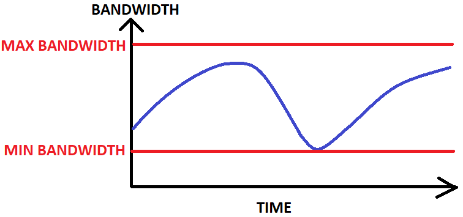

# CAKE with Adaptive Bandwidth - "autorate"

A script that automatically adapts
[CAKE Smart Queue Management (SQM)](https://www.bufferbloat.net/projects/codel/wiki/Cake/)
bandwidth settings by measuring traffic load and RTT times.
This is for use on variable bandwidth connections such as LTE,
and is not intended for use on connections that have a stable,
fixed bandwidth.

CAKE is an algorithm that manages the buffering of data being sent/received
by an [OpenWrt router](https://openwrt.org) so that no more data
is queued than is necessary, minimizing the latency (and bufferbloat)
and improving the network's responsiveness.

The present implementation of CAKE requires a fixed bandwidth setting.
This presents a challenge in applying CAKE
to variable bandwidth connections, because the
actual bandwidth at any given moment is unknown.

This script periodically updates CAKE's bandwidth
settings based on current measured conditions.

## Theory of Operation

The `autorate.sh` script runs regularly and
adjusts the bandwidth settings of the CAKE SQM algorithm
to reflect the current conditions on the bottleneck link.
The script is typically configured to run once per second
and make the following adjustments:

- When traffic is low, allow the bandwidth setting to decay
toward minimum configured value
- When traffic is high, incrementally increase the bandwidth setting
until a RTT spike is detected
or until the setting reaches the maximum configured value
- Upon detecting a RTT spike, decrease the bandwidth setting

The minimum bandwidth for the CAKE algorithm
should be set to at, or below, the slowest
observed bandwidth, and the maximum bandwidth
set to an estimate of the highest possible bandwidth
the connection can obtain.

Under no load, the routine will adjust the bandwidth
downwards towards the minimum set 'safe bandwidth' rates.
Ideally this setting will never result in bufferbloat even under full load.
It is recommended to set these to at, or slightly below,
the worst case bandwidth observed during testing,
e.g. during a period of peak ISP congestion.

The maximum bandwidth should be set to the lower
of the maximum bandwidth that the connection is
thought to be able to handle or the maximum bandwidth
required by the user.
The script will only adjust the bandwidth up
if there is no detected RTT spike.
Setting this value to a maximum required level
will have the advantage that the script will
stay at that level during optimum conditions
rather than always having to test whether the
bandwidth can be increased (which necessarily
results in allowing some excess latency).

To elaborate on the above, a variable bandwidth
connection may be most ideally divided up into
a known fixed, stable component, on top of which
is provided an unknown variable component:



The minimum bandwidth is then set to (or
slightly below) the fixed component, and the
maximum bandwidth may be set to (or slightly above)
the maximum observed bandwidth.
Or, if a lower maximum bandwidth is required
by the user, the maximum bandwidth is set
to that lower bandwidth as explained above.

There is a detailed discussion of the script's evolution on the
[OpenWrt Forum - CAKE /w Adaptive Bandwidth.](https://forum.openwrt.org/t/cake-w-adaptive-bandwidth/108848/312)

## Required packages

- **bc** for calculations
- **iputils-ping** for more advanced ping with sub 1s ping frequency
- **coreutils-date** for accurate time keeping
- **coreutils-sleep** for accurate sleeping

## Installation on OpenWrt

- Install SQM (`luci-app-sqm`) and enable CAKE on the interface(s)
as described in the
[OpenWrt SQM documentation](https://openwrt.org/docs/guide-user/network/traffic-shaping/sqm)
- [SSH into the router](https://openwrt.org/docs/guide-quick-start/sshadministration)
- Run the following commands to place the script at `/root/autorate.sh`
and make it executable:

   ```bash
   opkg update; opkg install bc iputils-ping coreutils-date coreutils-sleep
   cd /root
   wget https://raw.githubusercontent.com/lynxthecat/sqm-autorate/main/sqm-autorate.sh
   chmod +x ./sqm-autorate.sh
   ```

- Edit the `sqm-autorate.sh` script using vi or nano to supply
information about your router and your ISP's speeds.
The minimum bandwidth should be set to at, or below,
the lowest observed bandwidth, and the maximum bandwidth
set to an estimate of the best possible bandwidth
the connection can obtain.
Rates are in kilobits/sec - enter "36000" for a 36 mbps link.

  - Change `ul_if` and `dl_if` to match the names of the
upload and download interfaces to which CAKE is applied
These can be obtained, for example, by consulting the configured SQM settings
in LuCi or by examining the output of `tc qdisc ls`.
  - Set minimum bandwidth variables (`min_ul_rate` and `min_dl_rate` in the script)
to the minimum bandwidth you expect.
  - Set maximum bandwidth (`max_ul_rate` and `max_dl_rate`)
to the maximum bandwidth you expect your connection could obtain from your ISP.
  - Save the changes and exit the editor
  
## Manual testing

- Run the modified `autorate.sh` script:

   ```bash
   ./sqm-autorate.sh
   ```

- Monitor the script output to see how it adjusts the download
and upload rates as you use the connection.
(You will see this output if `enable_verbose_output` is set to '1'.
Set it to '0' if you no longer want the verbose logging.)
- Press ^C to halt the process.

## Install as a service

You can install this as a service that starts up the
autorate process whenever the router reboots.
To do this:

- [SSH into the router](https://openwrt.org/docs/guide-quick-start/sshadministration)
- Run these commands to install the service file
and start/enable it:

   ```bash
   cd /etc/init.d
   wget https://raw.githubusercontent.com/lynxthecat/sqm-autorate/main/sqm-autorate 
   service sqm-autorate start
   service sqm-autorate enable
   ```

When running as a service, the `autorate.sh` script outputs
to `/tmp/sqm-autorate.log` when `enable_verbose_output` is set to '1'.
